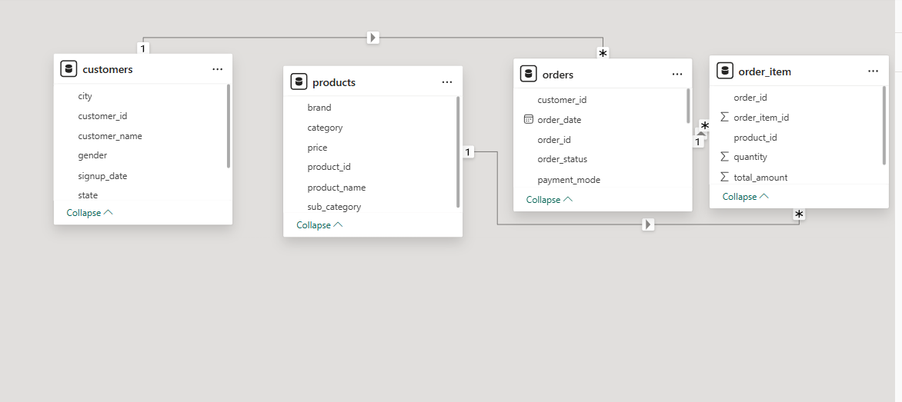
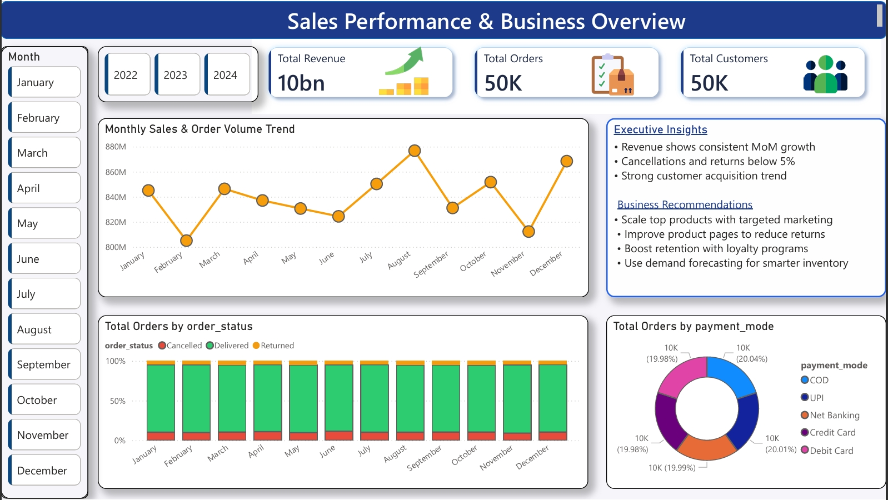
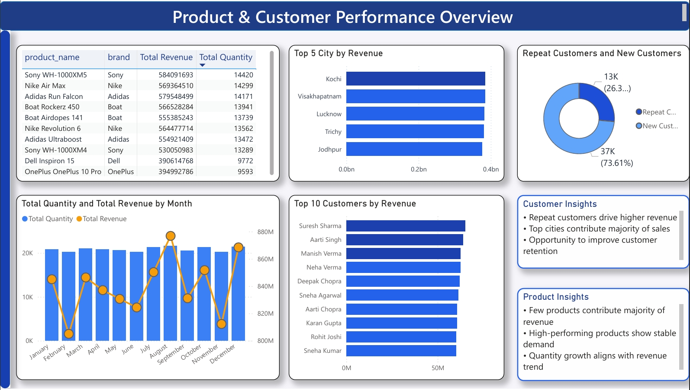
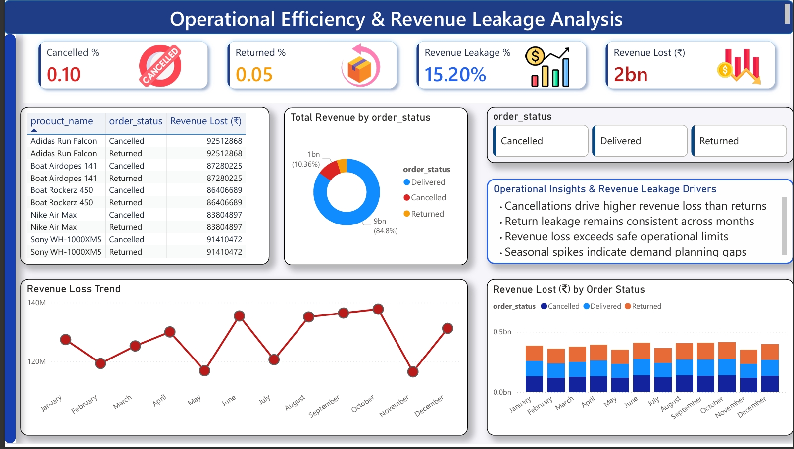

# 📊 E-Commerce Sales Analytics & Revenue Leakage Dashboard | SQL + Power BI

**Data Analyst Portfolio Project** — end-to-end analytics pipeline (SQL data modeling → DAX → Power BI) built on 50,000 orders and 100,000 order line items for a simulated e-commerce business.

`SQL` `Power BI` `DAX` `Data Modeling` `Star Schema` `Data Quality` `RFM Segmentation` `Cohort Analysis` `Business Intelligence`

---

## 📌 Business Problem

E-commerce leadership teams typically have clear visibility into *how much* they sell, but far less visibility into *how much revenue never survives to be realized* — cancellations and returns that erase revenue after it has already been counted. This project was built to answer four questions a real e-commerce operations or growth team would ask:

1. How much revenue is actually being lost to cancellations and returns, and is it material?
2. Is that leakage concentrated in a specific payment method, city, or customer segment — or is it systemic?
3. Does the common assumption that "a small number of products drive most of the revenue" actually hold up against the data?
4. Are repeat customers worth investing in relative to new customer acquisition?

Every number below is computed directly from the raw dataset via the SQL layer in this repo — not illustrative or placeholder figures.

---

## 🧰 Tools & Technologies

- **SQL** — staging, data validation, dimensional modeling (star schema), window functions (`RANK`, `NTILE`), analytics views
- **Power BI** — DAX measures, data modeling, executive-level dashboard design
- **Excel** — source data validation
- **Git/GitHub** — version control

---

## 🗂 Architecture

```
Raw Data (xlsx) → SQL Staging → Data Validation → Dimension/Fact Tables
→ SQL Analytics Layer (RFM, Cohort, Leakage, Ranking) → Power BI → Business Recommendations
```

SQL is used for all data cleaning, modeling, and analysis — Power BI is used purely for time intelligence and visualization, not for shaping the data. This mirrors how analytics teams actually separate the modeling layer from the reporting layer in production.

## 🗃 Dataset

| Table | Rows | Description |
|---|---|---|
| `customers` | 50,000 | Demographics, city/state, signup date |
| `orders` | 50,000 | Order status, payment mode, order date |
| `products` | 50,000 | Category, sub-category, brand, price |
| `order_items` | 100,000 | Line-item quantity and revenue |

**Data Model:** Star schema — `fact_orders` (grain = one row per order line item) joined to `dim_customer`, `dim_product`, and `dim_date`.



---

## 🔎 Data Quality — Validated, Not Assumed

Before a single dashboard number was calculated, the raw data was run through a 9-check validation layer covering referential integrity, duplicates, nulls, and logical consistency:

| Check | Result |
|---|---|
| Orphaned `order_items` (no matching product) | 0 |
| Orphaned `order_items` (no matching order) | 0 |
| Orphaned `orders` (no matching customer) | 0 |
| Duplicate primary keys (any table) | 0 |
| Nulls in `order_date` / `order_status` / `customer_id` | 0 |
| Negative or zero quantity/amount | 0 |
| Orders with zero order line items | 6,738 of 50,000 (13.5%) — correctly excluded from `fact_orders` by design (inner join); flagged rather than silently hidden |
| Orders dated before the customer's signup date | 18,710 of 50,000 (37.4%) — a genuine data quality issue in the source data, disclosed rather than silently filtered out |
| `order_status` domain | Exactly 3 values: Delivered (42,395), Cancelled (5,179), Returned (2,426) |

Full checks: `sql/data_quality/02_validation_checks.sql`

---

## 📈 Dashboard Pages

### 🔹 Page 1: Sales Performance & Business Overview
- Total Revenue, Orders, Customers
- Monthly sales trends
- Revenue by city and product
- Payment method distribution



---

### 🔹 Page 2: Product & Customer Performance
- Product-wise revenue and quantity, Pareto/concentration check
- Top customers by revenue
- Repeat vs. new customer split
- RFM-based customer segmentation



---

### 🔹 Page 3: Operational Efficiency & Revenue Leakage
- Cancellation rate and return rate
- Revenue lost to cancellations vs. returns
- Leakage by payment mode and by city
- Operational risk insights



---

## 🧮 KPIs

*(computed directly from `fact_orders` via `vw_kpi_summary` and related SQL views)*

| KPI | Value |
|---|---|
| Total Orders (with line items) | 43,262 |
| Total Customers (≥1 order with line items) | 28,935 |
| Total Revenue | ₹10,079,525,542 |
| Net Revenue (Delivered only) | ₹8,547,849,958 |
| Revenue Lost (Cancelled + Returned) | ₹1,531,675,584 |
| Revenue Leakage % | 15.2% |
| Average Order Value | ₹232,988 |
| Repeat Customer Revenue Share | 52.6% of revenue from 8,505 repeat customers (vs. 47.4% from 17,431 new customers) |

---

## 🧠 Key Insights

- **Revenue leakage is real and material**: 15.2% of total revenue (₹1.53bn) is lost to cancellations and returns — cancellations alone account for 10.36% of orders, about double the rate of returns (4.83%).
- **Payment mode is not a meaningful driver of risk**: cancellation rates across all 5 payment modes range from just 9.85% (Credit Card) to 10.59% (Net Banking) — under 1 percentage point of spread. Payment-mode-specific interventions would not move the needle.
- **Revenue leakage is geographically systemic, not regional**: the highest and lowest-leakage cities (Chennai at 15.84%, down to a tight 15.3–15.8% band elsewhere) differ by well under 1 percentage point — this is a process issue, not a location issue.
- **Revenue is broadly distributed, not concentrated in a few bestsellers**: the top 10% of products (4,064 of 40,642) account for only 31% of revenue, and the top 100 products alone account for just 1.46%. The common "a small set of products drives most revenue" assumption does not hold for this dataset.
- **Repeat customers already outperform new customers**: repeat customers are a minority of the active base (8,505 of ~26,000) but generate 52.6% of revenue — clear, quantified evidence for retention investment.
- **A meaningful share of registered customers never convert**: 18,366 of 50,000 customers (36.7%) have never placed an order — an acquisition-vs-activation gap distinct from the leakage problem.

---

## 🚀 Business Recommendations

1. **Treat revenue leakage as a systemic operations issue, not a payment-mode or regional one** — since both payment mode (9.85–10.59%) and city-level leakage (15.3–15.8%) are consistent, fixes belong in checkout/fulfillment process design.
2. **Invest in retention over acquisition-only growth** — repeat customers already deliver 52.6% of revenue from a minority of the customer base; a loyalty or win-back program has a clearly quantified upside.
3. **Investigate the 36.7% registered-but-never-ordered segment** — a larger opportunity pool than the leakage problem itself, and entirely outside the current dashboard's scope.
4. **Don't over-index on "best-seller" merchandising strategies** — with revenue this broadly distributed across the catalog, assortment and demand-planning strategy should account for a long tail, not a handful of hero SKUs.

---

## ⚠️ Data Limitations (disclosed, not hidden)

- 37.4% of orders have an order date earlier than the customer's signup date — a data generation artifact in this dataset, flagged in the data quality layer rather than silently corrected.
- 13.5% of orders have no order line items and are therefore excluded from all revenue-based analysis (`fact_orders` is built on an inner join) — a deliberate, documented modeling choice.

---

## 💼 Business Value

- Gives leadership a single source of truth for revenue, leakage, and customer KPIs
- Quantifies revenue leakage and identifies where it is (and isn't) concentrated
- Validates or corrects common business assumptions with actual data rather than intuition
- Supports data-driven prioritization between retention, acquisition, and fulfillment initiatives

---

## 🔮 Future Enhancements

- Predictive churn modeling on the RFM segments (Python/scikit-learn)
- Automated data quality alerting on the "orders before signup" issue at ingestion time
- Customer lifetime value (CLV) forecasting using cohort trajectories rather than static lifetime averages
- Real-time data integration for live KPI tracking

---

## 📁 Repository Structure

```
ecommerce-sales-analytics-powerbi/
├── data/raw/                  customers, orders, products, order_items (.xlsx)
├── sql/
│   ├── staging/                01_staging_tables.sql
│   ├── data_quality/           02_validation_checks.sql
│   ├── dimensions/             03_dim_tables.sql
│   ├── facts/                  04_fact_orders.sql
│   ├── analytics/              05-08: RFM, cohort, leakage, product ranking
│   └── procedures/             09_kpi_summary_and_refresh.sql
├── powerbi/
│   ├── ecommerce_dashboard.pbix
│   └── dax_measures/           DAX measures incl. time intelligence
├── screenshots/                data_model.png, page1-3 dashboard exports
└── README.md
```
